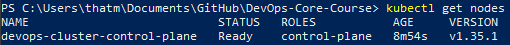
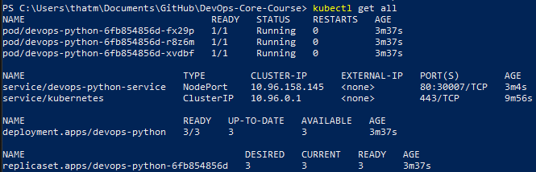
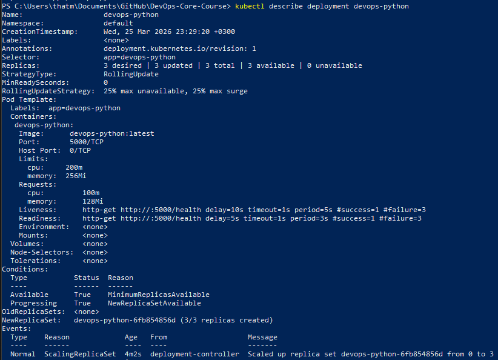
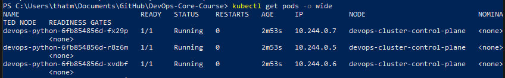
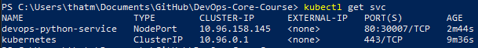
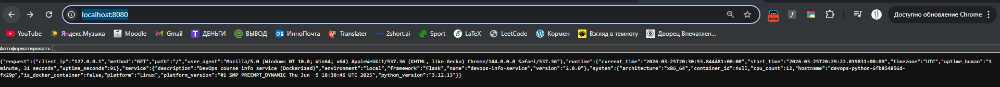
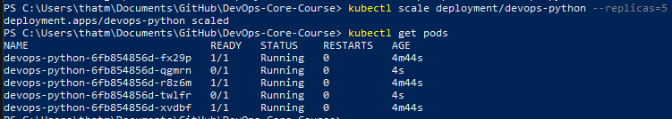
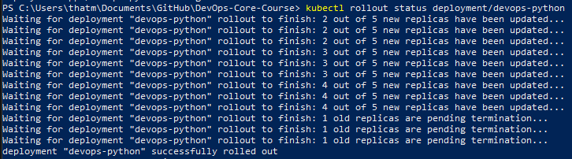
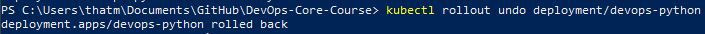

# Lab 9 — Kubernetes Fundamentals

## 1. Architecture Overview

This project deploys a Python Flask application to Kubernetes using a production-ready configuration.

**Architecture:**

User → Kubernetes Service (NodePort) → Deployment → Pods (Flask App)

* Deployment manages multiple replicas of the application
* Service provides a stable endpoint and load balancing
* Pods run containerized Python application

**Components:**

* 1 Deployment (devops-python)
* 5 Pods (replicas)
* 1 Service (NodePort)

---

## 2. Manifest Files

### deployment.yml

Defines application deployment with:

* 5 replicas for high availability
* Rolling update strategy (zero downtime)
* Resource limits and requests
* Liveness and readiness probes

**Key decisions:**

* `replicas: 5` — ensures scalability and fault tolerance
* `RollingUpdate` — enables zero-downtime updates
* Probes use `/health` endpoint for reliability

---

### service.yml

Defines network access to the application.

* Type: NodePort
* Exposes app externally
* Routes traffic to Pods using label selector

**Ports:**

* Service port: 80
* Container port: 5000
* NodePort: 30007

---

## 3. Deployment Evidence

### Cluster Info

```bash
kubectl get nodes
```

### Resources

```bash
kubectl get all
```

### Pods

```bash
kubectl get pods -o wide
```

### Services

```bash
kubectl get svc
```

### Deployment Details

```bash
kubectl describe deployment devops-python
```

### Application Test

```bash
kubectl port-forward service/devops-python-service 8080:80
curl http://localhost:8080
```

---

## 4. Operations Performed

### Deploy application

```bash
kubectl apply -f k8s/deployment.yml
kubectl apply -f k8s/service.yml
```

### Scaling

```bash
kubectl scale deployment/devops-python --replicas=5
```

### Rolling Update

```bash
kubectl apply -f k8s/deployment.yml
kubectl rollout status deployment/devops-python
```

### Rollback

```bash
kubectl rollout undo deployment/devops-python
```

---

## 5. Production Considerations

### Health Checks

* Liveness probe ensures container restart on failure
* Readiness probe ensures traffic is sent only to ready Pods

### Resource Management

* CPU and memory limits prevent resource exhaustion
* Requests ensure proper scheduling

### Improvements for Production

* Use Ingress instead of NodePort
* Add TLS/HTTPS
* Use Horizontal Pod Autoscaler
* Integrate with Prometheus and Grafana

---

## 6. Monitoring Strategy

* Logs: Loki + Promtail (Lab 7)
* Metrics: Prometheus (Lab 8)
* Dashboards: Grafana

This provides full observability:

* Logs → debugging
* Metrics → performance monitoring

---

## 7. Challenges & Solutions

### Issue: ImagePullBackOff

**Cause:** Kubernetes could not find local Docker image
**Solution:**

```bash
kind load docker-image devops-python:latest
```

---

### Issue: Service not accessible

**Cause:** NodePort not exposed in kind
**Solution:**

```bash
kubectl
```

## 📸 Screenshots

### Cluster & Nodes


### All Resources


### Deployment


### Pods


### Services


### Application Working


### Scaling


### Rolling Update


### Rollback
