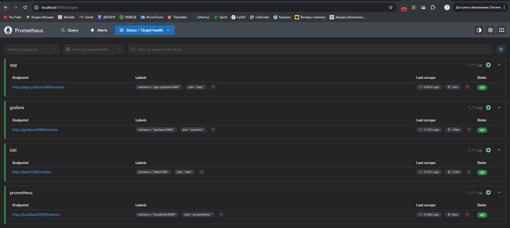
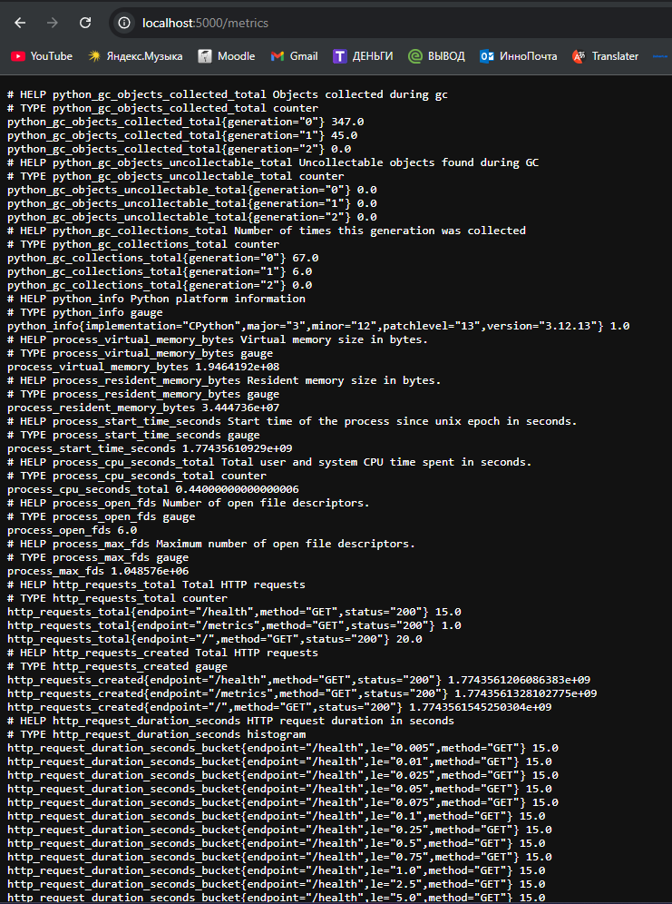
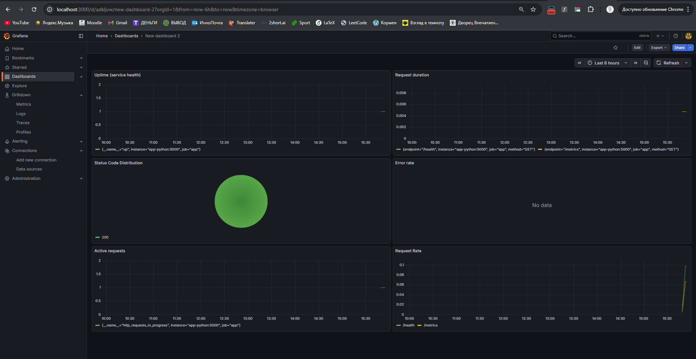
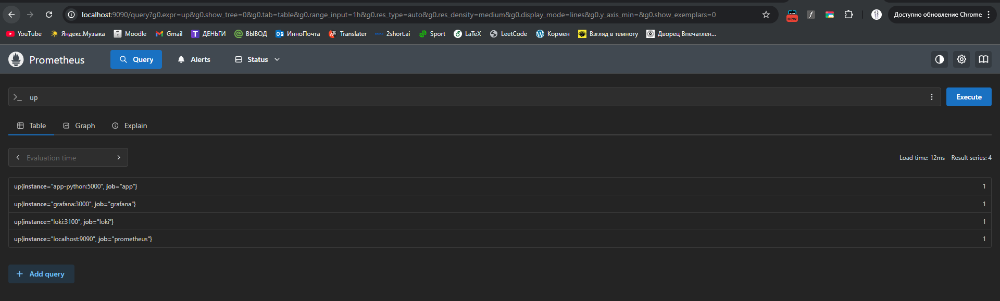

# Lab 8 — Metrics & Monitoring with Prometheus

## 1. Architecture

This lab extends the observability stack from Lab 7 by adding metrics collection.

Flow:
App → Prometheus → Grafana

* Application exposes `/metrics`
* Prometheus scrapes metrics every 15s
* Grafana visualizes metrics

Components:

* Prometheus — metrics collection and storage
* Grafana — visualization
* Python app — metrics exporter
* Loki — logs

---

## 2. Application Instrumentation

The application was instrumented using `prometheus_client`.

### Implemented Metrics

Counter:

* http_requests_total
* Labels: method, endpoint, status

Histogram:

* http_request_duration_seconds

Gauge:

* http_requests_in_progress

These metrics follow the RED method:

* Rate → request count
* Errors → failed requests
* Duration → latency

---

## 3. Prometheus Configuration

Scrape interval: 15s

Targets:

* prometheus:9090
* app-python:5000
* loki:3100
* grafana:3000

Config snippet:

```yaml
scrape_configs:
  - job_name: 'app'
    static_configs:
      - targets: ['app-python:5000']
    metrics_path: /metrics
```

Retention:

* 15 days
* 10GB

---

## 4. Dashboard Walkthrough

Request Rate:

```
sum(rate(http_requests_total[5m])) by (endpoint)
```

Error Rate:

```
sum(rate(http_requests_total{status=~"5.."}[5m]))
```

Request Duration (p95):

```
histogram_quantile(0.95, rate(http_request_duration_seconds_bucket[5m]))
```

Active Requests:

```
http_requests_in_progress
```

Status Code Distribution:

```
sum by (status) (rate(http_requests_total[5m]))
```

Service Uptime:

```
up{job="app"}
```

---

## 5. PromQL Examples

```
rate(http_requests_total[5m])
sum(rate(http_requests_total[5m]))
sum by (endpoint) (rate(http_requests_total[5m]))
histogram_quantile(0.95, rate(http_request_duration_seconds_bucket[5m]))
up == 0
```

---

## 6. Production Configuration

Resource Limits:

* Prometheus: 1 CPU / 1GB RAM
* Grafana: 1 CPU / 1GB RAM
* Loki: 1 CPU / 1GB RAM
* App: 0.5 CPU / 512MB RAM

Health Checks:

* Prometheus: /-/healthy
* App: /health
* Grafana: /api/health
* Loki: /ready

Persistence:

* prometheus-data
* grafana-data
* loki-data

---

## 7. Testing Results

* Prometheus targets are UP
* Metrics endpoint is accessible
* Dashboard shows live data
* Logs and metrics work together

---

## 8. Challenges & Solutions

Prometheus config error:

* retention settings in YAML caused error
* fixed by moving retention to command

No metrics in Grafana:

* wrong data source URL
* fixed using http://prometheus:9090

---

## 9. Metrics vs Logs

* Logs show events
* Metrics show aggregated data

Both are required for observability

---

## Evidence

### Prometheus Targets



### Metrics Endpoint



### Dashboard



### PromQL Query


